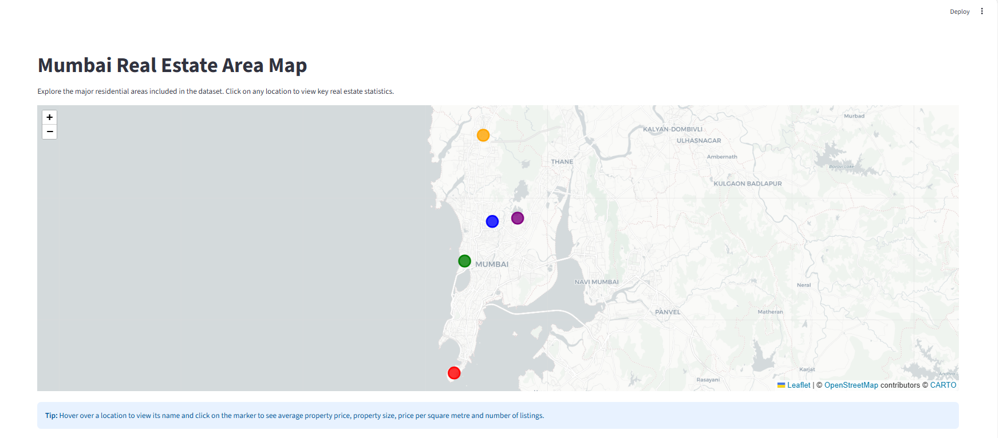
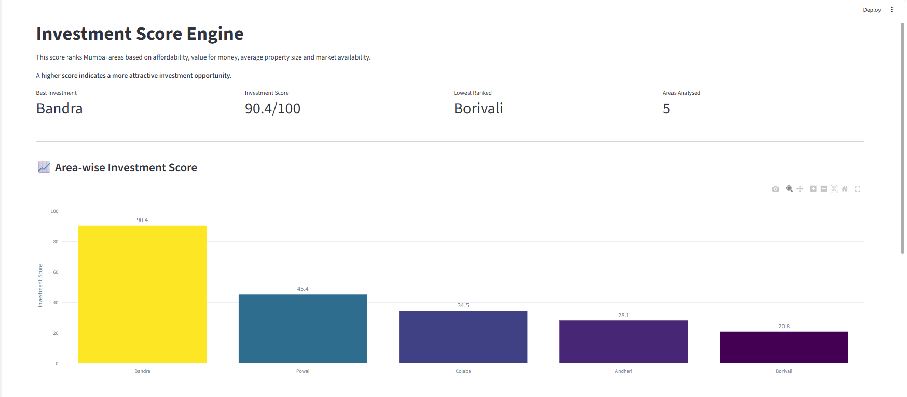
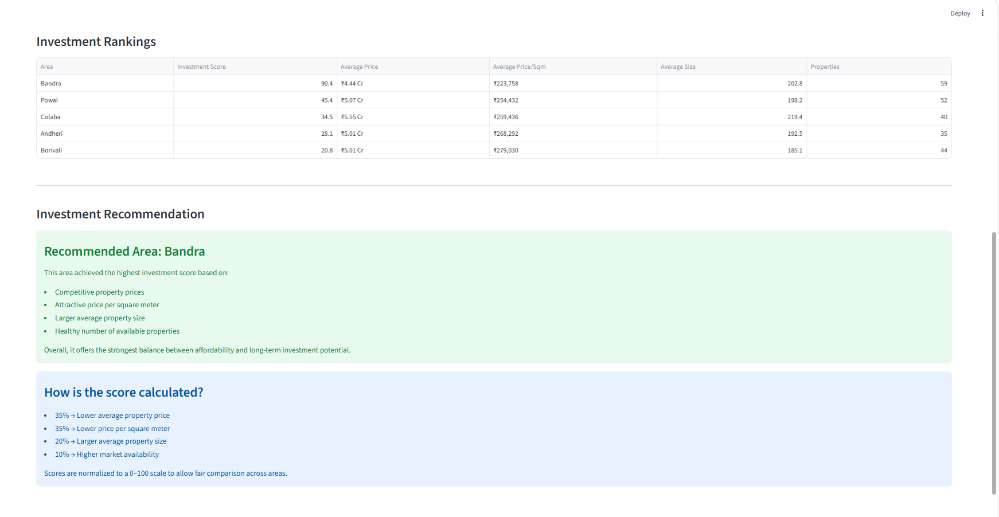
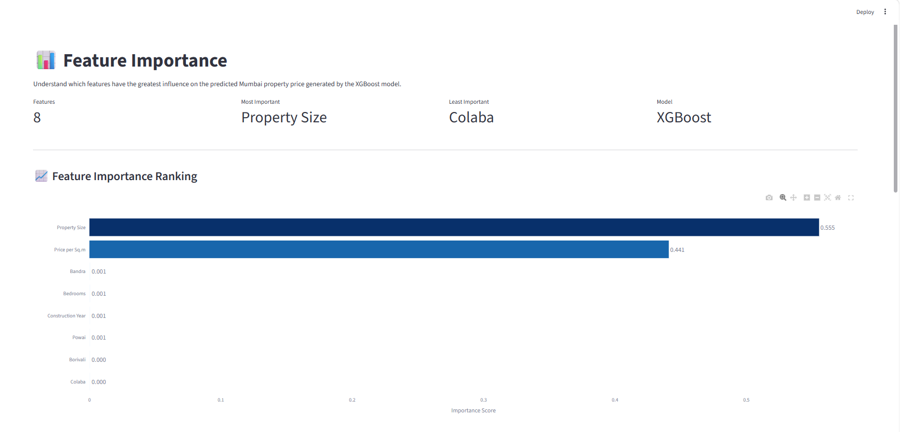
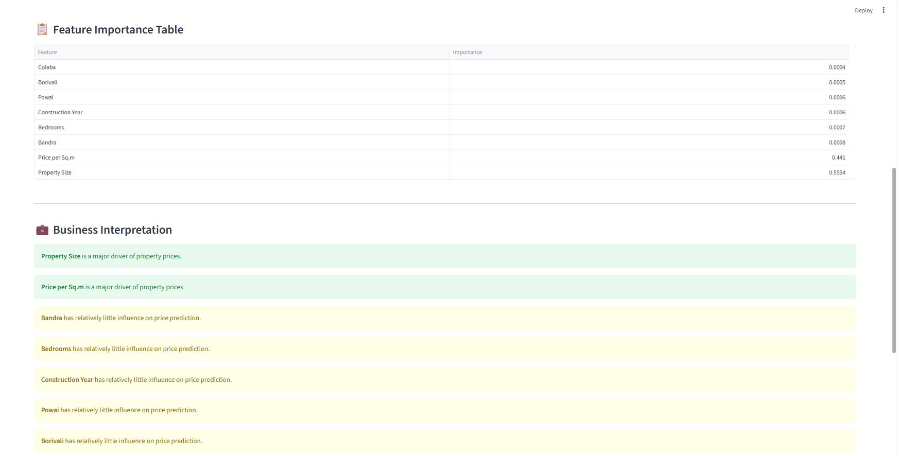
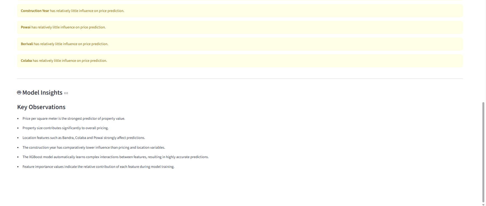
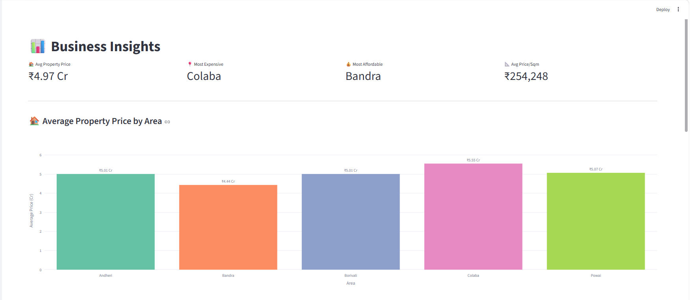
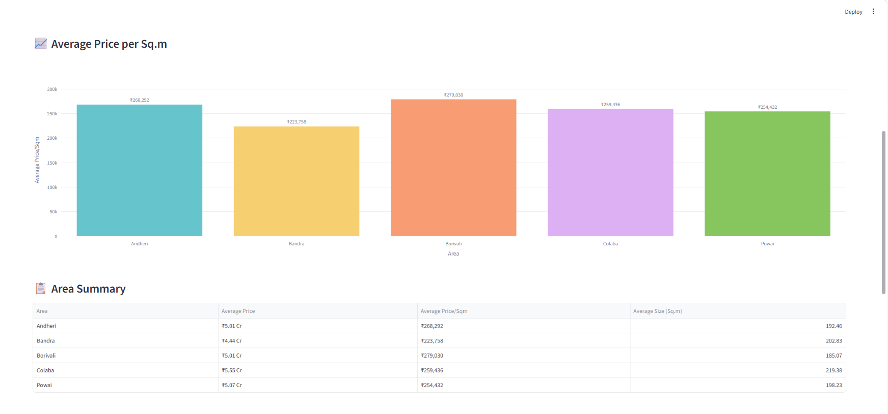
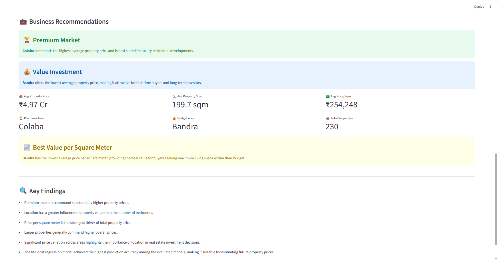

# Mumbai Real Estate Intelligence Dashboard

An end-to-end Data Science project that analyzes Mumbai housing market trends and predicts property prices using Machine Learning.

The project combines Exploratory Data Analysis (EDA), Feature Engineering, Predictive Modeling, and Interactive Business Intelligence dashboards to help users evaluate real estate investments in Mumbai.

# Project Overview

The Mumbai real estate market is highly dynamic, with property prices influenced by factors such as location, area, BHK configuration, property age, and amenities.

This project aims to:

* Predict residential property prices using Machine Learning
* Compare localities across Mumbai
* Analyze key price-driving factors
* Identify investment opportunities
* Visualize market trends through an interactive Streamlit dashboard

# Business Insights

Property buyers and investors often struggle to determine:

* Whether a property is fairly priced
* Which localities provide better value for money
* Future price appreciation potential
* Important factors influencing property prices

This dashboard provides data-driven insights to support real estate decision-making.

# Tech Stack

# Programming Language

* Python

# Libraries

* Pandas
* NumPy
* Scikit-learn
* XGBoost
* Plotly
* Matplotlib
* Seaborn
* Streamlit

# Tools

* Jupyter Notebook
* VS Code
* Git
* GitHub

# Project Structure

Mumbai_Real_Estate_Intelligence/

|-- dashboard/

│ |-- app.py

│ |-- pages/

│ |-- Area_Comparison.py

│ |-- Business_Insights.py

│ |-- Feature_Importance.py

│ |-- Investment_Score.py

│ |-- Mumbai_Heatmap.py

│ |-- Price_Prediction.py

|-- data/

│ |-- raw/

│ |-- cleaned/

|-- models/

│ |-- final_xgboost_model.pkl

|-- notebooks/

|-- reports/

│ |-- screenshots/

|-- requirements.txt

|-- README.md

# Dataset

The dataset contains Mumbai residential property listings and includes:

* Area
* Year
* Price_per_sqm_Local
* Size_sqm
* Bedrooms
* Total_Price_Local

After cleaning and preprocessing, the dataset was used for both exploratory analysis and predictive modeling.

# Machine Learning Model

# Model Used

* XGBoost Regressor

# Why XGBoost?

* Handles non-linear relationships effectively
* Robust to feature interactions
* High predictive performance
* Industry-standard gradient boosting algorithm

# Model Workflow

1. Data Cleaning
2. Feature Engineering
3. Train-Test Split
4. Model Training
5. Hyperparameter Tuning
6. Performance Evaluation
7. Deployment using Streamlit

# Dashboard Features

# 1. Price Prediction

Predict estimated property prices based on:

* Area
* Year
* Size(sqm)
* Bedrooms
* Price per sqm

# 2. Mumbai Heatmap

Visual representation of high and low price zones across Mumbai.

# 3. Investment Score

Ranks properties based on investment attractiveness and expected value.

# 4. Area Comparison

Compare multiple localities on:

* Average Price
* Price per Sq.ft.
* Market Position

# 5. Feature Importance

Identify the most influential factors affecting property prices.

# 6. Business Insights

Generate actionable market insights and trends for investors and buyers.

# Dashboard Screenshots

# Home Page

# Area Comparison

# Mumbai Heatmap

# Investment Score

# Feature Importance

# Business Insights

# Price Prediction

# Installation

Clone the repository:
git clone https://github.com/yourusername/Mumbai_Real_Estate_Intelligence.git

Navigate to the project directory:
cd Mumbai_Real_Estate_Intelligence

Install dependencies:
pip install -r requirements.txt

Run the Streamlit app:
streamlit run app.py

# Key Learnings

* End-to-end Data Science workflow
* Feature Engineering techniques
* XGBoost model implementation
* Business Intelligence dashboard design
* Data storytelling and insight generation
* Model deployment using Streamlit

# Author

Vaishnavi Teli

Aspiring Data Analyst | Data Scientist

Mumbai, India

LinkedIn: www.linkedin.com/in/vaishnavi-teli

GitHub: VaishnaviTeli11